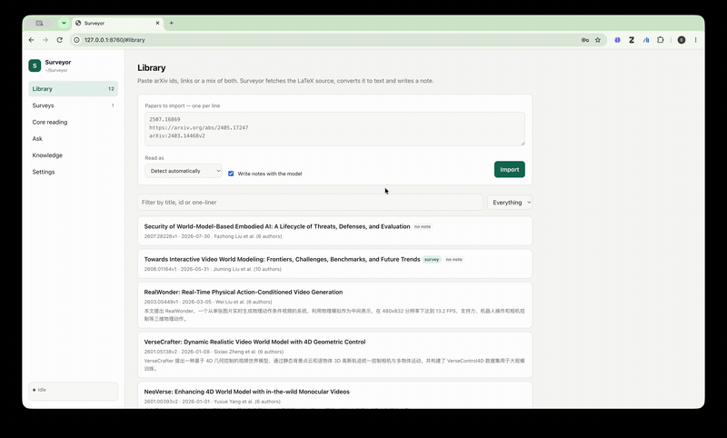
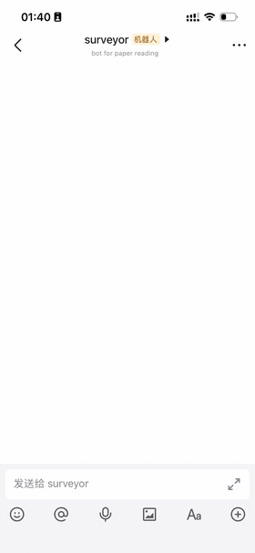

<div align="center">

# Surveyor

**Don't let barriers to information kill your curiosity.**

Build a map of a research field from arXiv. Import papers and surveys by id or
link, get the field's taxonomy and its core reading list, and ask questions in
Chinese or English — from your browser, your terminal, or Feishu / WeCom.

<table>
<tr>
<td align="center" width="70%">

</td>
<td align="center" width="30%">

</td>
</tr>
</table>

</div>

---

Surveyor treats a **survey (综述) as a seed for the whole library**. A survey's
section hierarchy *is* a taxonomy of its field, written by people who read
everything; its bibliography is a curated reading list; and where a reference is
cited tells you which branch of the taxonomy it belongs to. All three are read
straight out of the paper's own structure, so they cost no API calls and do not
depend on a model getting it right.

And when you import **several surveys of the same field**, the references they
share are the field's real core — computed by counting, not guessed.

## 📦 Install

Requires Python 3.10 or newer.

```bash
pip install git+https://github.com/hebing-sjtu/surveyor.git
surveyor gui
```

That opens the app in your browser. On first run it asks for two things: where to
keep your library, and which model to use. Everything else happens in the app.

<details>
<summary>Installing from a clone instead</summary>

```bash
git clone https://github.com/hebing-sjtu/surveyor.git
cd surveyor
pip install .
surveyor gui
```

</details>

### Choosing a model

Surveyor talks to any **OpenAI-compatible** endpoint, so you can point it at a
hosted provider or at a model running on your own machine. The Settings page has
these as presets; you only need to paste an API key.

| Provider | Base URL | Example model |
| --- | --- | --- |
| DeepSeek | `https://api.deepseek.com` | `deepseek-v4-flash` |
| 通义千问 Qwen | `https://dashscope.aliyuncs.com/compatible-mode/v1` | `qwen-plus` |
| Moonshot Kimi | `https://api.moonshot.cn/v1` | `kimi-k3` |
| 智谱 GLM | `https://open.bigmodel.cn/api/paas/v4` | `glm-5.2` |
| OpenAI | `https://api.openai.com/v1` | `gpt-5.6-terra` |
| OpenRouter | `https://openrouter.ai/api/v1` | any slug |
| Ollama (local) | `http://localhost:11434/v1` | `gpt-oss:20b` |

**Test the connection** on the Settings page confirms the key and model before you
spend anything on a real paper. Your key is written to a `.env` file in your
library folder, readable only by you, and never leaves your machine except to go
to the provider you chose.

Much of Surveyor works with no key at all: importing papers, turning them into
readable Markdown, extracting a survey's taxonomy skeleton and bibliography,
ranking its reading list, and finding the references several surveys agree on.
Notes, answers and syntheses are the parts that need a model.

## 🖥️ Using the app

`surveyor gui` opens six pages.

| Page | What it is for |
| --- | --- |
| **Library** | Paste arXiv ids or links and import them. Every paper gets a note: problem, method, contributions, results, limitations, open questions. |
| **Surveys** | Each survey's taxonomy and its reference list, ranked by how much the survey actually discusses each work, with the branch it belongs to. One button imports the top ones. |
| **Core reading** | Works that several surveys independently cite. No model involved — this is counting. |
| **Ask** | Questions across the library, or scoped to one paper. Every claim cites `[paper_id §section]`. |
| **Knowledge** | Syntheses across papers: a topic digest, a library overview, a concept glossary, a merged field map. |
| **Settings** | Model, language, where the library lives, and which chat bots are on. |

Long jobs — importing a 600-reference survey, writing a note — run in the
background with a live log in the sidebar, so you can keep reading while they
work. The app listens on `127.0.0.1` only and is not reachable from the network.

### A first session

1. **Import a survey of your field.** Paste its arXiv id on the Library page. If
   the title does not contain the word "survey", set *Read as* to Survey.
2. **Open it under Surveys.** You now have the field's branches and a ranked
   reading list, with which branch each work belongs to.
3. **Import the top 10 it cites.** One button on the same page.
4. **Ask something.** "有哪些方法用相机轨迹控制视频生成？各自的取舍是什么？"

Then import a second and third survey of the same field, and **Core reading**
fills in with the papers all of them agree on.

## 🗺️ What the surveys give you

Reference ranking counts citations in running prose separately from citations
inside comparison tables, because a survey's big method table cites dozens of
works under whichever heading it happens to sit near. Only prose citations decide
which branch a paper is filed under.

**Find missing arXiv ids** handles references that cite the conference version
with no arXiv number attached: it searches arXiv by title and accepts only a
near-exact match, since a wrong id is worse than a missing one.

**Core reading** matches by arXiv id, the only identifier that survives each
survey's own citation-key conventions. Run across three video-generation surveys
it surfaces CogVideoX, Make-A-Video, Stable Video Diffusion, VideoGPT and
classifier-free guidance: the field's canon, derived rather than asserted.

**Reconcile surveys into a field map** then asks the model where the surveys carve
the field the same way, where they genuinely disagree, how the framing shifted
between an older survey and a newer one, and which subareas only one of them
covers. The shared-reference table in that document is computed, not generated.

## 🌏 Language

Notes and answers are written in Chinese by default, with technical terms left in
English — 对比学习 (contrastive learning), not a translated term nobody uses. The
Settings page switches between Chinese, English and bilingual output.

## ⌨️ From the terminal

Everything in the app is also a command, and the two share one library.

```bash
surveyor add 2503.07598 https://arxiv.org/abs/2506.05284 reading-list.md
surveyor survey add 2507.16869
surveyor survey refs 2507.16869 --section "Camera"
surveyor survey harvest 2507.16869 -n 10
surveyor survey core
surveyor ask "how do these papers keep long-horizon geometry consistent?"
surveyor compare 2503.07598v2 2506.05284v1 --aspect "conditioning mechanism"
surveyor status
```

`surveyor --help` lists the rest. The shorter `paper` command is installed as an
alias. Anything containing an arXiv id works as input: bare ids, pinned versions,
`abs`/`pdf` URLs, mirrors, legacy ids like `hep-th/9901001`, or a Markdown file
full of them.

## 💬 Chat bots

The same commands work in Feishu and WeCom, so you can paste a link into a group
chat and ask about the paper later. `surveyor chat` runs the same conversation
locally with no setup at all.

Turn a bot on under **Settings → Chat bots**, then start it from the terminal.
Either platform can run without a public URL, by dialling out and holding the
connection open instead of waiting to be called:

```bash
surveyor feishu-connect    # Feishu over a long connection, nothing to expose
surveyor wecom-connect     # WeCom over a long connection, nothing to expose
surveyor serve             # webhooks: POST /webhook/feishu, GET+POST /webhook/wecom
```

Because summarizing a paper takes minutes while both platforms time out in
seconds, an acknowledgement goes out immediately and the real answer is pushed
afterwards.

<details>
<summary><b>Feishu / Lark setup</b></summary>

One app, two ways for its events to reach you. A **长连接** dials out from this
machine, so nothing has to be exposed; a **请求地址** is an HTTPS callback. The
credentials are the same either way — the delivery mode is a single choice in the
console.

<b>Long connection</b> — the 长连接 delivery mode; no public URL, no encryption key:

1. Create a self-built app in the [developer console](https://open.feishu.cn/app).
2. Put its App ID and App Secret in the `.env` beside your library, which Surveyor
   creates with these keys blank:

   ```bash
   FEISHU_APP_ID="cli_..."
   FEISHU_APP_SECRET="..."
   ```

3. 权限管理 → grant the message scopes. The bot has to read what is addressed to
   it *and* send its own messages, so all seven:

   ```
   im:message
   im:message:readonly
   im:message:send_as_bot
   im:message.p2p_msg:readonly
   im:message.group_msg
   im:message.group_at_msg:readonly
   im:message.group_at_msg.include_bot:readonly
   ```

   `im:message:send_as_bot` is the one that makes a reply possible — without it
   the event still arrives and the answer fails silently on the way out. The
   `p2p_msg` and `group_at_msg` scopes decide whether a direct message or an @
   mention in a group reaches the bot at all. Scope changes take effect only once
   you publish a new version of the app.

4. 事件与回调 → choose **长连接** as the delivery mode, then subscribe to
   `im.message.receive_v1`. Nothing to fill in: no request URL, no encryption
   key, no verification token.
5. Turn Feishu on under Settings → Chat bots, then:

   ```bash
   pip install "lark-oapi>=1.7"    # or: pip install ".[feishu]"
   surveyor feishu-connect
   ```

Your machine dials out to Feishu and holds the connection open, so events arrive
on a socket you opened and replies go straight back. The console's **验证连接状态**
button turns green once `surveyor feishu-connect` is running, and the SDK
reconnects by itself if the link drops.

For Lark international, change `base_url` under `[feishu]` in `config.toml` to
`https://open.larksuite.com/open-apis`; the long connection follows it.

<b>Webhook</b> — the 请求地址 delivery mode, for a host that already has a domain:

1. Steps 1–3 above are unchanged: the same app, credentials and scopes.
2. 事件与回调 → pick **请求地址** and point it at
   `https://your-host/webhook/feishu`.
3. Start `surveyor serve` before you click save, since saving triggers the
   verification handshake. For local testing, tunnel it with
   `cloudflared tunnel --url http://localhost:8000`.
4. If you also switch encryption or token verification on, add
   `FEISHU_ENCRYPT_KEY` / `FEISHU_VERIFICATION_TOKEN` to `.env`; the signature is
   verified whenever it is present.

If the bot stays silent, the `.env` it reads is the one in your library folder, not
the one in a source checkout. `surveyor status` prints whether it found the
credentials there.

</details>

<details>
<summary><b>WeCom (企业微信) setup</b></summary>

Two routes here as well, except these are different kinds of bot rather than two
modes of one, so their credentials differ. A **智能机器人** can hold a long
connection, so nothing has to be exposed; a **自建应用** is reached at a callback
URL. Pick one — a robot's API 模式 is either/or, and switching it retires the other.

<b>Long connection</b> — a 智能机器人 in 长连接 API 模式; no public URL, no encryption
key:

1. 管理后台 → 智能机器人 → create a robot, then open its configuration page.
2. Turn on **API 模式** and choose **长连接**. The page then shows a **BotID** and a
   **Secret**; that Secret belongs to the long connection and has nothing to do
   with the Token / EncodingAESKey a callback URL uses.
3. Put both in the `.env` beside your library, which Surveyor creates with these
   keys blank:

   ```bash
   WECOM_BOT_ID="..."
   WECOM_BOT_SECRET="..."
   ```

4. Turn WeCom on under Settings → Chat bots, then:

   ```bash
   pip install "wecom-aibot-python-sdk>=1.0.2"    # or: pip install ".[wecom]"
   surveyor wecom-connect
   ```

Your machine dials out to `wss://openws.work.weixin.qq.com` and keeps the socket
open, so messages arrive without anything listening on a port, and the SDK sends
the heartbeat and reconnects by itself. One robot holds one connection, so a
second `wecom-connect` on the same BotID kicks the first off. Message the robot
directly, or @ it in a group it belongs to.

A private deployment has its own gateway address — put it in `ws_url` under
`[wecom]` in `config.toml`.

<b>Webhook</b> — a 自建应用 with 设置API接收, and the route that also pushes digests:

1. 应用管理 → 自建 → 创建应用. Give it a name, pick who can use it, create it.
2. Collect three values:
   - **AgentId** and **Secret**, on the app's own page;
   - **企业ID**, under 我的企业 → 企业信息 (this is the CorpID).

   Put them in the `.env` beside your library:

   ```bash
   WECOM_CORP_ID="ww1234567890abcdef"
   WECOM_CORP_SECRET="..."
   WECOM_AGENT_ID="1000002"
   ```

3. Turn WeCom on under Settings → Chat bots and save. While the switch is off the
   callback endpoint answers 403, and WeCom's verification would fail.
4. Give the server a public address, since WeCom has to reach it. For a laptop,
   `cloudflared tunnel --url http://localhost:8000` prints an `https://…` host.
5. On the app's page: 接收消息 → 设置API接收.
   - **URL** — `https://your-host/webhook/wecom`
   - **Token** and **EncodingAESKey** — click 随机获取 for both, then copy them
     into `.env`:

   ```bash
   WECOM_TOKEN="..."
   WECOM_AES_KEY="the 43-character EncodingAESKey"
   ```

6. Start (or restart) `surveyor serve` **before** you click 保存 in that dialog.
   Saving makes WeCom immediately call the URL with a signed `echostr`, and the
   handshake fails unless the two values above are already loaded — `.env` is read
   once at startup, so a running server will not see them.
7. Message the app from WeCom on your phone. `add 2503.07598`, then `ask …`.

Optional: `WECOM_WEBHOOK_URL`, the 群机器人 webhook of a group (群设置 → 群机器人 →
添加), which is where scheduled digests get pushed.

If sending fails with `errcode 60020, not allow to access from your ip`, add the
server's outbound IP to 企业可信IP on the app's page. If it fails with
`unexpected receive id`, your app reports a ReceiveID that is not the CorpID — set
`WECOM_RECEIVE_ID` to the value shown on the 设置API接收 page.

`surveyor status` prints which of the two routes it found credentials for, which
is the quickest way to catch a BotID that was pasted into the wrong variable.

</details>

Commands work in Chinese or English, with or without a leading slash:

```
add 2503.07598              导入 2503.07598
list / find spatial memory  列表 / 搜索 spatial memory
summary vace                总结 vace
ask how is memory handled?  问 记忆是怎么处理的？
survey add 2507.16869       综述 add 2507.16869
harvest 2507.16869 10       采集 2507.16869 10
field / core                领域 / 核心文献
lang zh | lang en | lang bilingual
```

Pasting a bare arXiv link adds the paper, and any message that is not a
recognised command is treated as a question.

## 📁 Where things are stored

Everything is plain Markdown and JSON, so your library stays greppable, diffable
and easy to back up.

```
papers/<arxiv_id>/
├── source/          the paper as arXiv publishes it
├── meta.json        bibliographic record
├── fulltext.md      the whole paper as clean Markdown
├── summary.md       the note, for humans
├── survey.md        surveys only: taxonomy + reading list
└── references.json  surveys only: what it cites, and where
knowledge/
├── index.md         table of contents
├── overview.md      what the library adds up to
├── glossary.md      concept → papers
├── topics/*.md      per-area synthesis
└── fields/*.md      several surveys reconciled into one map
```

The folder is whatever you chose on the Settings page, `~/Surveyor` by default.
`surveyor home /path/to/library` moves it from the terminal, and
`SURVEYOR_HOME=/path/to/library` overrides it for a single command.

## ⚖️ License

[PolyForm Noncommercial 1.0.0](LICENSE) — free for research, teaching, personal
projects and any other noncommercial purpose. For commercial use, please get in
touch.
